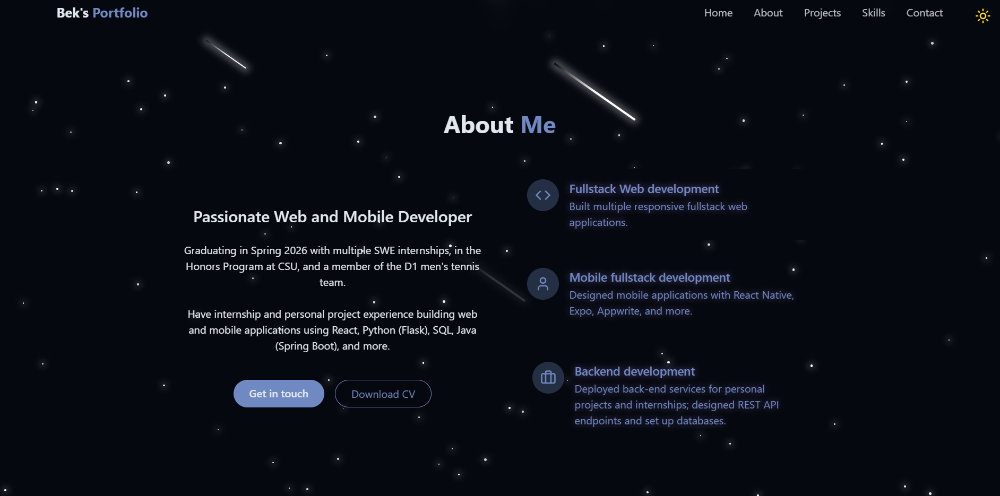

# Personal Portfolio Website

A beautiful responsive portfolio to showcase projects, skills, and contact info.

## 🚀 Live Demo
Deployed on Railway — **[View Live Demo](https://react-portfolio.up.railway.app/)**

## 📸 Screenshot

---

## ✨ Features
- Responsive layout (mobile → desktop)
- Sections: About, Skills, Projects, Contact
- Smooth scrolling & hover effects
- Themed UI tokens (e.g., `bg-card`, `text-muted-foreground`)
- Iconography via `lucide-react`

## 🧰 Tech Stack
- **React + Vite**
- **Tailwind CSS**
- **lucide-react** for icons
